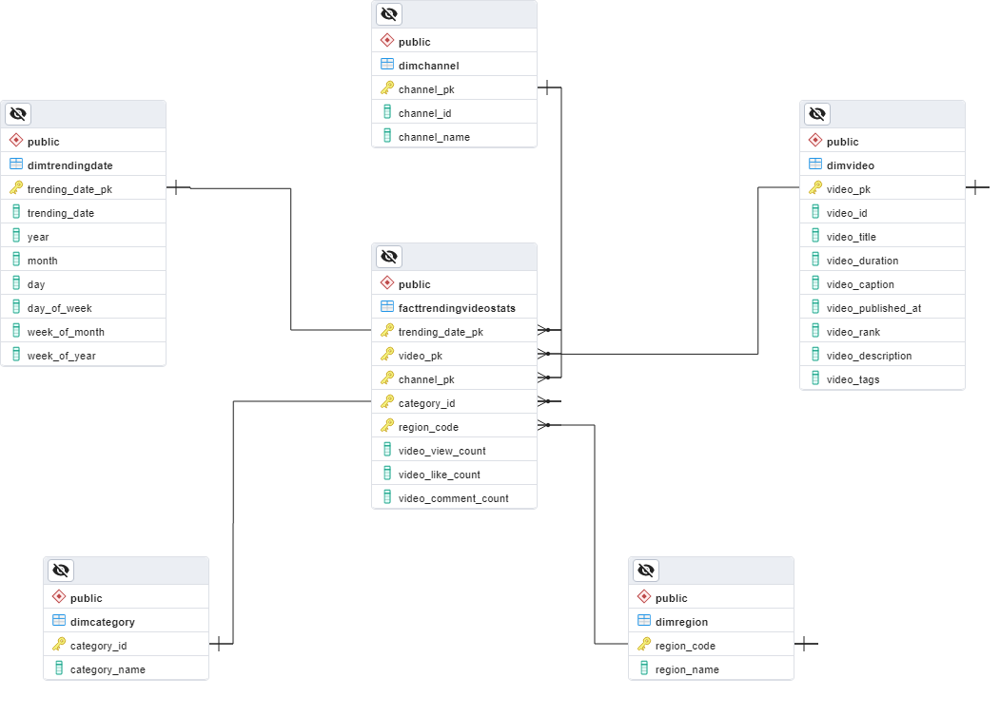
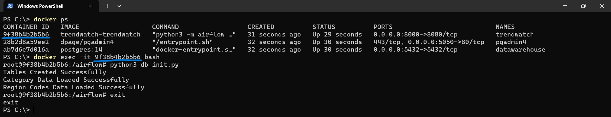
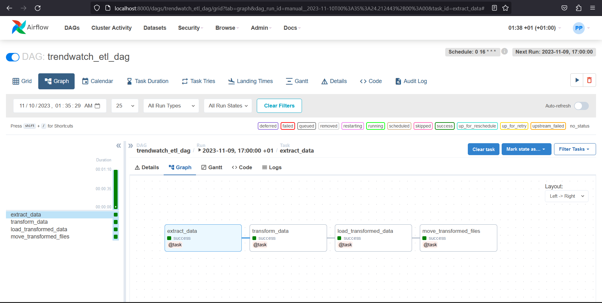

# **Project 📝: TrendWatch - Keep Up To Date With Trending Videos**
- [**Project 📝: TrendWatch - Keep Up To Date With Trending Videos**](#project--trendwatch---keep-up-to-date-with-trending-videos)
- [**1. Project overview**](#1-project-overview)
	- [1. Project objectives](#1-project-objectives)
	- [2. Data source and collection📊](#2-data-source-and-collection)
		- [Data source: YouTube](#data-source-youtube)
		- [Data collection](#data-collection)
			- [YouTube API key](#youtube-api-key)
			- [Key data points](#key-data-points)
			- [API endpoints](#api-endpoints)
	- [3. Data transformation and processing🔧](#3-data-transformation-and-processing)
	- [4. Data pipeline and workflow🌊](#4-data-pipeline-and-workflow)
	- [5. Data storage and warehousing💾](#5-data-storage-and-warehousing)
		- [Data storage technology](#data-storage-technology)
		- [Data modeling](#data-modeling)
- [**2. Project installation🔧**](#2-project-installation)
	- [Clone this repository](#clone-this-repository)
	- [Install on Docker](#install-on-docker)
	- [Install locally on Linux (Ubuntu)](#install-locally-on-linux-ubuntu)
	- [Setting up the database](#setting-up-the-database)
		- [Install PostgreSQL 14 database](#install-postgresql-14-database)
		- [Connect to postgreSQL](#connect-to-postgresql)
		- [Create the database](#create-the-database)
	- [Install project requirements](#install-project-requirements)
		- [Run db\_init.py to create tables \& initialize the database](#run-db_initpy-to-create-tables--initialize-the-database)
		- [Install airflow](#install-airflow)
	- [Run the main.py script to execute the ETL pipeline WITHOUT airflow](#run-the-mainpy-script-to-execute-the-etl-pipeline-without-airflow)

# **1. Project overview**
This comprehensive **data engineering project** is designed as an end-to-end initiative, focusing on the implementation of a robust **data warehouse** and an **automated data pipeline**.\
The primary objective is to establish a daily **ETL** (Extract, Transform, Load) process that systematically acquires, transforms, and loads **up-to-date** information on trending videos.

To enhance accessibility and maintain code **idempotence**, the project is **containerized**, facilitating seamless sharing and deployment.

## 1. Project objectives
1. **Data modeling:** Develop a robust data model to represent the structure and relationships within the dataset effectively.
2. **Design and implement a data warehouse:** Create a data warehouse architecture to store and manage structured data efficiently.
3. **Fetch trending videos data from the YouTube API:** Utilize the YouTube API to retrieve real-time information on trending videos, ensuring up-to-date and relevant data.
4. **Data transformation:** Apply comprehensive data transformations to enhance the quality, consistency, and usability of the fetched data before integration into the data warehouse.
5. **Data loading to the data warehouse:** Implement a process for loading transformed data into the data warehouse, ensuring integrity and accessibility for analytical purposes.
6. **Workflow automation:** Develop an automated workflow system to streamline the end-to-end data pipeline, reducing manual intervention and enhancing overall efficiency.
7. **Run the data pipeline daily:** Schedule and execute the data pipeline on a daily basis to keep the information in the data warehouse up-to-date and reflective of the latest trends in YouTube video data.

## 2. Data source and collection📊
### Data source: YouTube
The primary data source for this project is YouTube, the world's largest video-sharing platform.\
YouTube provides a public API that allows developers to access a wide range of data related to videos, channels, playlists, and more. In this project, we use the YouTube API to fetch data about trending videos.
### Data collection
#### YouTube API key
To access the YouTube API, you will need to obtain an API key from the Google Cloud Console.\
Follow these steps to obtain your API key: [YouTube Data API Overview | Google for Developers](https://developers.google.com/youtube/v3/getting-started)\
For more information about the API visit the documentation page: [YouTube Data API reference documentation](https://developers.google.com/youtube/v3/docs)

> You should include your YouTube API key in the project configuration,`.env` file, or environment variables to authenticate your API requests.


#### Key data points
- **Video Details**: Title, description, publish date, view count, likes, dislikes, comments, etc.
- **Trending Statistics**: Trending date, category, region, etc.

#### API endpoints
To collect data, the following API endpoint is used:
- GET /videos: Retrieve video details based on video IDs or URLs, retrieves a list of YouTube's most popular videos based on region code.
  - The **regionCode** parameter identifies the country for which you are retrieving videos.
  - You could also use the **videoCategoryId** parameter to retrieve the most popular videos in a particular category.

For a complete understanding of this endpoint read the [reference](https://developers.google.com/youtube/v3/docs/videos/list).
> Before running the ETL pipeline, ensure you have set up your YouTube API key and configured it properly in the project.
## 3. Data transformation and processing🔧
- **Data cleaning and validation**: While the data is relatively clean and structured, a validation process is implemented to address scenarios where data might be missing or newly created data could potentially violate the integrity of the dimension tables. This ensures that the dataset maintains a high level of quality, contributing to the overall reliability of the information.
- **Data transformation**: The data transformation efforts revolve around the `transform.py` module, where **data classes** and **functions** are employed to **parse** and **transform dimensions** and **facts**. This phase is critical for converting raw data into a structured format suitable for analysis and storage in the **data warehouse**.
- **Data enrichment**:  The data is enhanced with category IDs and region codes, providing additional dimensions for a more insightful analysis. This step contributes to a comprehensive understanding of the trending videos data.
- **Data storage**: The next step after the transformation process is the storage of the enriched data in the data warehouse. Here, the transformed data is loaded into tables, ensuring relationships between dimensions and facts are maintained. The focus is on optimizing storage for efficient querying and facilitating seamless analysis.

## 4. Data pipeline and workflow🌊
- **Pipeline architecture**:
The data pipeline architecture is designed to facilitate the smooth flow of data from extraction to storage. It encompasses a systematic arrangement of the ETL components to ensure efficiency and reliability.
- **Dependency management**:
  - **Package management using `pip`:** Dependencies are managed using the Python package manager, pip, ensuring that the necessary libraries and tools are installed and up-to-date.
  - **Virtual environment using `venv` Module:** To create an isolated development environment, venv is employed. This ensures that the project's dependencies are contained and don't interfere with other projects.
  - **Version control** : Using **`Git`** enables effective collaboration, tracks changes, and provides a history of project modifications.
  - **[Dockerfile](Dockerfile) for containerization:** The project is containerized using a Dockerfile. This aids in portability, easing the sharing of the project and ensuring the reproducibility of the environment.
  - **[Docker-Compose](docker-compose.yaml):** Docker Compose is utilized for orchestrating the deployment of multiple Docker containers. It simplifies the process of defining and running multi-container Docker applications, ensuring consistency across different environments.
- **Scheduling and orchestration:**
  - **`Apache Airflow`:** Scheduling and orchestration are managed by Apache Airflow. This powerful tool allows for the creation, scheduling, and monitoring of complex data workflows, providing a centralized platform for managing the entire data pipeline.

## 5. Data storage and warehousing💾
### Data storage technology
  - **`PostgreSQL`:** The chosen data storage technology is PostgreSQL, a powerful open-source relational database management system. Leveraging its robust features, we ensure data integrity, scalability, and efficient querying capabilities for our data warehousing needs.

### Data modeling
- **`Star Schema`:** The schema design follows the star schema, a widely used dimensional modeling technique. This design comprises a central fact table connected to dimension tables, optimizing query performance and simplifying the analysis of data. The star schema enhances our ability to derive meaningful insights from the stored information.


# **2. Project installation🔧**
## Clone this repository
I am assuming you have `git` installed
```bash
git clone https://github.com/HichamAtanane/TrendWatch.git
cd TrendWatch
mkdir -p data/output data/staging data/logs
```
## Install on Docker
```bash
# open a terminal
docker compose up
# open a new terminal
docker ps
# get trendwatch container_id
docker exec -it <container_id> bash
# run db_init.py to create tables & to populate categories_id and region_codes tables
python3 db_init.py
# exit terminal
exit
```


Now you can access :
- Airflow interface : http://localhost:8000
- pgadmin interface : http://localhost:5050

## Install locally on Linux (Ubuntu)

## Setting up the database
### Install PostgreSQL 14 database
_https://www.postgresql.org/download/linux/ubuntu/_
```bash
sudo sh -c 'echo "deb https://apt.postgresql.org/pub/repos/apt $(lsb_release -cs)-pgdg main" > /etc/apt/sources.list.d/pgdg.list'
wget --quiet -O - https://www.postgresql.org/media/keys/ACCC4CF8.asc | sudo apt-key add -
sudo apt-get update
sudo apt-get -y install postgresql-14
```
### Connect to postgreSQL
```bash
sudo -u postgres psql
```
### Create the database
```sql
CREATE DATABASE youtube 
	WITH ENCODING='UTF8' 
		LC_CTYPE='en_US.UTF-8' 
		LC_COLLATE='en_US.UTF-8' 
		TEMPLATE=template0;
```
or simply
```sql
CREATE DATABASE youtube;
```
## Install project requirements
make sure you install python-dev and libq-dev to ensure successful installation of the psycopg2 package
```bash
sudo apt-get install python3.11-dev libpq-dev
# install requirements
python3 -m pip install -r requirements.txt
```
### Run db_init.py to create tables & initialize the database
```bash
python3 db_init.py
```
### Install airflow
_https://airflow.apache.org/docs/apache-airflow/stable/start.html_
```bash
# it is recommended that you clone the project to this directory ~/airflow
export AIRFLOW_HOME=~/airflow

AIRFLOW_VERSION=2.7.3

PYTHON_VERSION="$(python --version | cut -d " " -f 2 | cut -d "." -f 1-2)"

CONSTRAINT_URL="https://raw.githubusercontent.com/apache/airflow/constraints-${AIRFLOW_VERSION}/constraints-${PYTHON_VERSION}.txt"

python3 -m pip install "apache-airflow==${AIRFLOW_VERSION}" --constraint "${CONSTRAINT_URL}"
# The airflow standalone command initializes the database, creates a user, and starts all components.
python3 -m airflow standalone
```



## Run the main.py script to execute the ETL pipeline WITHOUT airflow
```bash
python3 main.py
```
